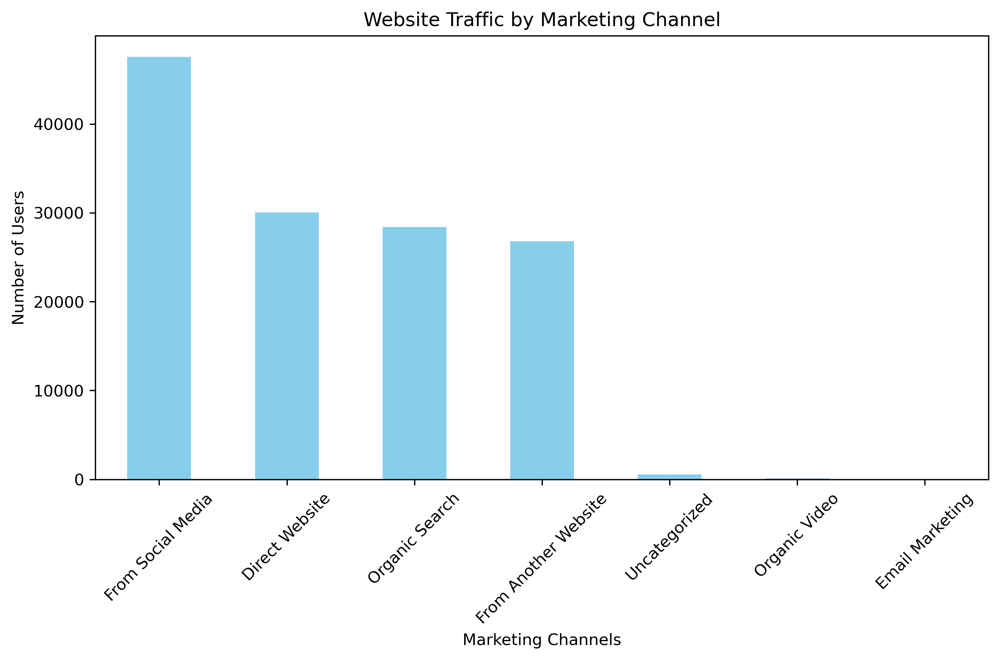
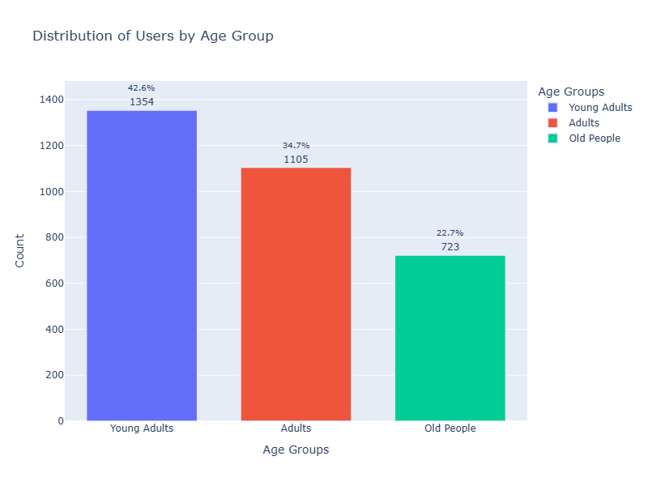

<h1 style="text-align: center;">Website Performance Analysis With Python</h1>

<div align="center">
  
</div>

## Background Story: Optimizing 929 Fitness for Peak Performance
<details>
  <summary>Click to expand</summary>
  <br>
In today's fast-paced digital world, a website's performance is more than important. Users expect instant access to information and seamless experiences, and any delay can lead to frustration and lost engagement. This is especially important for businesses like 929 Fitness, where online presence is essential for connecting with clients and sharing valuable health and wellness content.

Imagine a potential client trying to access 929 Fitness's workout routines or nutrition advice, only to be met with slow loading times. They might quickly lose interest and seek information elsewhere. This not only impacts user experience but also hinders 929 Fitness's ability to inspire and motivate its audience.

That's why understanding and optimizing website performance is crucial. Web Performance Analysis allows us to measure, diagnose, and improve the speed, efficiency, and reliability of 929 Fitness's online platform. By analyzing key metrics, we can ensure that users have a smooth and engaging experience, fostering a stronger connection with the brand.

929 Fitness is dedicated to providing a holistic approach to fitness and well-being, blending exercise, nutrition, mental health, and lifestyle. Their website serves as a central hub for this information, offering workout routines, expert advice, and community-driven content.

This project leverages the power of Python to delve into 929 Fitness's website performance. We'll analyze critical metrics to identify bottlenecks, suggest data-driven improvements, and even predict web traffic patterns. By automating this analysis, we can provide 929 Fitness with actionable insights, ensuring their website remains a powerful tool for promoting health and wellness in the digital age. We will be using this data to ensure that the site is running at its best, especially during peak times, as we know that we have peak traffic at 11am and 9pm.

</details>

## Project Objective:
<details>
  <summary>Click to expand</summary>
 <br>
The goal of this project is to analyze, diagnose, and optimize 925 Fitness Company website performance using Python. By collecting and evaluating key performance metrics, the project aims to answer critical questions, including:

1. Where do visitors come from, and who are they? (Traffic Sources and Demographics)
2. How long do people stay on the site, and when is it busiest? (Session Analysis)
3. What do users do on the site, and do they find it engaging? (User Engagement and Behavior)
4. Which strategies are most effective in driving traffic to the site? (Channel Performance)
5. How many visitors can we expect in the next day? (Website Traffic Forecasting)

Using Python and data-driven techniques, this project will provide insights to optimize website speed, enhance user experience, and improve traffic acquisition strategies.
</details>

## How to Run The Source Code Locally:
<details>
  <summary>Click to expand</summary>

### First, check out the code and its output here: [925 Website Performance Analysis.ipynb](https://colab.research.google.com/drive/1qg95To4QTQlNtKyN9Jb9Mns9slKGOuOD?usp=sharing)
  
## Here are the Setup and Execution instructions:
### Prerequisites

Before you can run this code, you'll need to have the following installed:

* **Python:** You can download the latest version from [python.org](https://www.python.org/downloads/).
  
* **Jupyter Notebook:** Install it using pip:
    ```bash
    pip install notebook
    ```
* **Git (Optional but Recommended):** To clone the repository, download from [git-scm.com](https://git-scm.com/downloads).
  
* **Required Python Libraries:** Install Pandas, Matplotlib, Plotly, NumPy, statsmodels, and specifically, the plot_acf and plot_pacf functions from the statsmodels.graphics.tsaplots module, as well as the SARIMAX module:
    ### OR
  ```bash
    pip install pandas matplotlib plotly numpy statsmodels  # Use VS Code terminal or Google Colab
    ```
### Cloning the Repository (Use VS Code Terminal or Windows Command Prompt):

1.  Clone the repository to your local machine:
    ```bash
    git clone [https://github.com/DataWithMowa/Website_Performance_Python_Analysis.git]
    ```
2.  Navigate to the project directory:
    ```bash
    cd [https://github.com/DataWithMowa/Website_Performance_Python_Analysis.git]
    ```
### Setting Up a Virtual Environment (Recommended)

1.  Create a virtual environment:
    ```bash
    python3 -m venv venv
    ```
2.  Activate the virtual environment:
    * On Windows:
        ```bash
        venv\Scripts\activate
        ```
    * On macOS/Linux:
        ```bash
        source venv/bin/activate
        ```
### Installing Dependencies

1.  Install the required Python libraries:
    ```bash
    pip install pandas matplotlib plotly numpy statsmodels
    ```
### Running the Jupyter Notebook

1.  Start Jupyter Notebook from the project directory:
    ```bash
    jupyter notebook
    ```
2.  Your web browser will open, displaying the Jupyter Notebook interface.
3.  Navigate to and open the `925 Website Performance Analysis.ipynb` file.
4.  Run the cells in the notebook sequentially by clicking "Cell" > "Run All" or by pressing Shift + Enter in each cell.

### Data and Configuration

* Find and download the dataset used in this analysis in the `Dataset/` directory.
  
### Jupyter Notebook

 * Here is the Jupyter source file for this project: [925 Website Performance Analysis.ipynb](https://colab.research.google.com/drive/1qg95To4QTQlNtKyN9Jb9Mns9slKGOuOD?usp=sharing)
</details>

## Data Overview:
<details>
  <summary>Click to expand</summary>
 <br>This dataset is a big collection of information about how people are using a website. It’s like a logbook that tracks who’s visiting, when, how they got there, and what they’re doing. It covers stuff like marketing channels, dates, user counts, session details, engagement stats, and info about the visitors themselves (like age, gender, location, and device). 
 
### What’s in the Dataset:
<details>
  <summary>Click to expand</summary>
 <br> 
Here’s a rundown of each column and what it tells us:

1. **Marketing Channels**  
   - This shows how people found the website. Examples are “Direct Website” (they typed the URL or used a bookmark), “From Social Media” (came from platforms like Twitter or Facebook), “Organic Search” (found it via Google), “Organic Video” (maybe from YouTube), and “Uncategorized” (not sure how they got there).

2. **Date + Hour (YYYY-MM-DD-HR)**  
   - The exact date and hour when the data was recorded, like “2024-04-16 23:00:00” (April 16, 2024, at 11 PM). It helps track when people visit.

3. **No. Of Users**  
   - How many unique people visited during that hour. Ranges from 0 to hundreds (e.g., 237 users at one point).

4. **No. Of Session of Users**  
   - Total visits (sessions) by those users in that hour. A user might visit more than once, so this can be higher than the number of users (e.g., 300 sessions for 237 users).

5. **Engaged Sessions**  
   - Sessions where people actually did something—like clicked around or stayed a while—instead of just bouncing off. For example, 144 engaged sessions out of 300 total sessions.

6. **Average Engagement Time Per Session in Seconds**  
   - How long people stuck around per session, in seconds. Varies a lot, from 0 (they left right away) to over 4,000 seconds (over an hour!).

7. **Engaged Sessions Per User**  
   - Average number of engaged sessions per person. If it’s 0.6, that means each user had 0.6 engaged sessions on average (some had none, some had more).

8. **Events Per Session**  
   - How many actions (like clicks or page views) happened per session. Higher numbers mean people were more active (e.g., 4.67 events per session).

9. **Engagement Rate**  
   - The percentage of sessions that were engaged (engaged sessions divided by total sessions). A rate of 0.48 means 48% of sessions had some activity.

10. **Event Count**  
    - Total number of actions across all sessions in that hour. For example, 1,402 events means lots of clicking or scrolling happened.

11. **Age**  
    - The average (or maybe typical) age of users in that hour, ranging from 18 to 60.

12. **Age Groups**  
    - Groups users into “Young Adults” (roughly 18-34), “Adults” (35-49), or “Old People” (50+). Matches the age column.

13. **Gender**  
    - Whether the users were mostly “Male” or “Female” during that hour.

14. **Location**  
    - Where users were from, like “UK,” “Nigeria,” “United States,” “Australia,” etc. Shows the website’s global reach.

15. **Device Type**  
    - What device they used: “Mobile,” “Tablet,” or “Desktop.” Tells you if it’s phone users, tablet fans, or computer folks.

</details>
</details>

## Tools and Libraries Used:

<details>
  <summary>Click to expand</summary>
  <br>
  For this analysis, I utilized the following tools and libraries:

  * **Jupyter Notebook:** This interactive environment was used for writing, executing, and documenting the Python code, allowing for a clear and reproducible workflow.
  * **Pandas Python Library:** Pandas was employed for data manipulation, cleaning, and analysis. It facilitated tasks such as data loading, merging, filtering, and aggregation.
  * **Matplotlib Python Library:** Matplotlib was used for creating static, interactive, and animated visualizations in Python. It provides a wide range of plotting options for data exploration and presentation.
  * **Plotly Python Library (plotly.py):** Plotly was used for creating interactive and informative data visualizations, enabling effective exploration and communication of insights.
  * **NumPy Python Library:** NumPy was utilized for numerical computations, providing support for large, multi-dimensional arrays and matrices, along with a collection of mathematical functions to operate on these arrays.
  * **statsmodels Python Library:** statsmodels was employed for statistical modeling, including time series analysis. It provided tools for estimating statistical models, performing statistical tests, and exploring data.
  * **plot\_acf and plot\_pacf (from statsmodels.graphics.tsaplots):** These functions were used specifically for time series analysis to generate Autocorrelation Function (ACF) and Partial Autocorrelation Function (PACF) plots, which are essential for identifying the parameters of ARIMA and SARIMA models.
  * **SARIMAX (from statsmodels.tsa.statespace.sarimax):** SARIMAX, or Seasonal AutoRegressive Integrated Moving Average with eXogenous regressors, was used for time series forecasting. It allows for the modeling of seasonal patterns and the inclusion of external factors to improve prediction accuracy.
</details>

## Data Cleaning and Preparation:

<details>
  <summary>Click to expand</summary>
  <br>

Before analysis, the raw dataset underwent a thorough cleaning and preparation phase using Microsoft Excel to ensure data clarity and consistency. The following transformations were applied:

* **Column Header Renaming:**
    * "Session primary channel group" was renamed to "Marketing Channels" for improved clarity.
    * "Date + hour (YYYYMMDDHH)" was renamed to "Date + Hour (YYYY-MM-DD-HH)" to adhere to a more standard date format.
    * "Users" was renamed to "No. Of Users".
    * "Session" was renamed to "No. Of Sessions of Users".
    * "Average engagement time per session" was renamed to "Average Engagement Time Per Session in Seconds" for increased specificity.
    * "Engaged sessions per user" was renamed to "Engaged Sessions Per User".
    * "Engagement rate" was renamed to "Engagement Rate".
    * "Events per session" was renamed to "Events Per Session".

* **Column Value Renaming:**
    * "Direct" (within the "Marketing Channels" column) was renamed to "Direct Website" for better context.
    * "Organic Social" was renamed to "From Social Media".
    * "Email" was renamed to "Email Marketing".
    * "Referral" was renamed to "From Another Website".

* **Date and Time Formatting:**
    * The "Date + Hour (YYYY-MM-DD-HH)" column values were converted to a date and time format.
    * Custom formatting was applied to display the date and hour as YYYY-MM-DD-HH.

* **Data Alignment and Formatting:**
    * The alignment for the columns "Average Engagement Time Per Session in Seconds", "Engaged Sessions Per User", "Events Per Session", and "Engagement Rate" was corrected for visual consistency.

These steps were crucial for ensuring the dataset was accurate, well-structured, and ready for subsequent analysis.
</details>

## Exploratory Data Analysis(EDA):
<details>
  <summary>Click to expand</summary>
 <br>

**Objective:**
The primary objective of this EDA was to understand the 925 Fitness Company website's traffic patterns, user demographics, and engagement metrics to identify optimization opportunities.

**Methodology:**
The EDA involved analyzing website traffic data, including traffic sources, user demographics (age, gender, location, device type), temporal patterns (time of day, day of week, month), user engagement metrics (average engagement time, engaged sessions, events per session, engagement rate), and channel performance. Correlation analysis was also performed to understand the relationships between engagement metrics.

**Key Findings:**

* **Traffic Sources:** Social media is the dominant traffic source, followed by direct website visits and organic search.
  
  
* **Demographics:**
    * Young adults (20s-30s) are the largest user group.
      
      
    * A near-equal distribution of male and female users.
      
    * Australia, the U.S., Nigeria, and South Africa are the top geographic locations.
    * Traffic is evenly distributed across mobile, desktop, and tablet devices.
* **Temporal Patterns:**
    * Peak traffic occurs at 11 AM and 9 PM.
    * Weekday traffic is significantly higher than weekend traffic, with Wednesday being the peak day.
    * April had a significantly higher amount of traffic than May.
* **User Engagement:**
    * April 17, 2024, at 18:00 had the highest number of user sessions.
    * "Organic Video" and "From Another Website" have higher engagement rates and events per session compared to social media.
* **Correlation Analysis:**
    * A strong positive correlation exists between "Engaged Sessions Per User" and "Engagement Rate."
</details>

## Data Analysis:
<details>
  <summary>Click to expand</summary>
 <br>

**Traffic Source Optimization:**
* Analysis of traffic sources led to recommendations for optimizing each channel, focusing on leveraging social media, improving direct website experience, and enhancing organic search presence.
* Recommendations were made to address the large drop in traffic between April and May.
**Demographic Targeting:**
* Demographic analysis led to recommendations for tailoring content and marketing strategies to specific age groups, genders, and geographic locations.
* Device type analysis showed the importance of a multi-device experience.
**Temporal Pattern Optimization:**
* Analysis of traffic patterns by time of day and day of week resulted in recommendations for scheduling content and promotions during peak hours and weekdays.
* The large traffic drop from April to May was also analyzed.
**User Engagement Improvement:**
* Correlation analysis highlighted the importance of improving "Engaged Sessions Per User" to boost overall engagement rates.
* Channel performance was analysed.
**Website Traffic Forecasting:**
* SARIMA model was used to forecast website traffic for the next 24 hours.
* PACF and ACF charts were used to determine SARIMA model parameters.
</details>

## Key Findings & Insights
<details>
  <summary>Click to expand</summary>
 <br>

* Social media is a powerful traffic driver, but engagement varies across channels.
* Understanding user demographics is crucial for targeted marketing and content creation.
* Temporal traffic patterns offer opportunities for strategic content scheduling.
* Improving engaged sessions is key to boosting overall engagement rates.
* A large and sudden drop in traffic requires urgent investigation.
* The SARIMA model can provide valuable traffic forecasts.
</details>

## Recommendations:
<details>
  <summary>Click to expand</summary>
 <br>

* Implement strategies to boost engagement on social media.
* Tailor content and marketing to specific demographic groups.
* Schedule content and promotions during peak traffic times.
* Focus on improving engaged sessions through interactive content.
* Investigate and correct the large traffic drop from April to May.
* Leverage SARIMA model forecasts for resource planning.
* Optimize the website for all device types.
* Focus on content strategy, and referral relationships to increase engagement.
</details>

## Limitations:
<details>
  <summary>Click to expand</summary>
 <br>

* The analysis is based on available website traffic data, which may have limitations in accuracy or completeness.
* The SARIMA model forecasts are based on historical data and may not account for unforeseen events.
* The data used in this project was cleaned using Microsoft Excel, and that process may contain limitations.
* The sudden extreme drop in traffic from April to May makes further analysis difficult.
</details>
  
## Summary:
<details>
  <summary>Click to expand</summary>
 <br>

This project provided a comprehensive analysis of the 925 Fitness Company website's performance, covering traffic sources, demographics, engagement, and forecasting. The analysis revealed key insights into user behavior and identified opportunities for optimization. Recommendations were provided to enhance website performance and user engagement.
</details>

## Challenges and Lessons Learned:
<details>
  <summary>Click to expand</summary>
 <br>

* Resolved issues with Plotly chart rendering in Google Colab by using `fig.show(renderer="colab")`.
* Understood the importance of thorough documentation and the time commitment involved.

**Why Google Colab?**

* Google Colab provides a free and accessible environment for running Python code and sharing notebooks.
* Although local jupyter notebooks work well, Google colab allows for easy sharing of the project.

**Documenting on GitHub**

* Documenting on GitHub is a valuable but time-consuming process that enhances project transparency and reproducibility.
</details>
